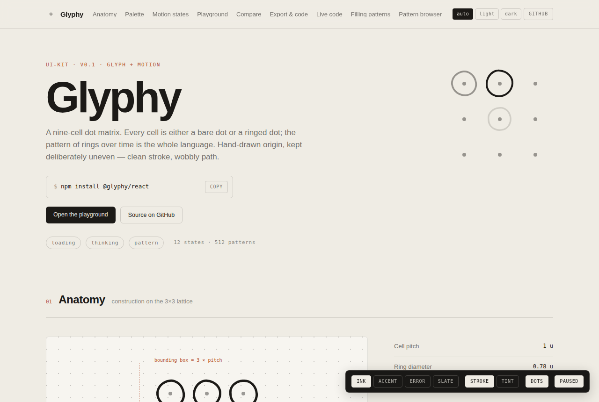

# Glyphy

**[The kit page →](https://cuberhuber.github.io/glyphy/)** — every state live,
a playground for every prop, and all 512 patterns to browse.

[](https://github.com/CuberHuber/glyphy/actions/workflows/ci.yml)
[](https://codecov.io/gh/CuberHuber/glyphy)
[](https://www.npmjs.com/package/@glyphy/react)
[](https://bundlephobia.com/package/@glyphy/react)
[](https://www.0pdd.com/p?name=CuberHuber/glyphy)
[](https://hitsofcode.com/view/github/CuberHuber/glyphy?branch=main)
[](LICENSE.txt)

A nine-cell dot matrix. Every cell is either a bare dot or a ringed dot, and the
pattern of rings over time is the whole language: a loading spinner, a thinking
indicator, a progress stepper and a background texture are all the same mark
under different instructions.

Hand-drawn origin, kept deliberately uneven — clean stroke, wobbly path.

```bash
npm install @glyphy/react
```

```tsx
import { Glyph } from '@glyphy/react';

<Glyph variant="travel" size={96} label="Loading" />;
```

That is the whole API for most people. Everything below is detail.

## Why it is built this way

**Rings are CSS borders, not paths.** Each ring is a `<div>` with an irregular
`border-radius` and a rotation. There is no SVG, no sprite sheet and no canvas,
so the mark is crisp at any size, the hand-drawn wobble costs nothing to render,
and the whole of `@glyphy/react` is a few kilobytes.

**The wobble is fixed, never random.** Nine hardcoded signatures, one per cell,
the same on every render forever. Randomising per instance would make the mark
shimmer and stop it being recognisable — so the library will not do it, and
there is no option to.

**Every frame is a pure function of `(variant, tick, cell)`.** Nothing in
`@glyphy/core` owns a timer, touches the DOM or holds state. That is what makes
the mark server-renderable, snapshot-testable, and replayable frame by frame —
and it is why `packages/core/test/frames.test.ts` can pin the animation to exact
numbers rather than to "it moved".

**One clock for the whole page.** Every mark reads the same counter, so a row of
marks with staggered phases reads as one ring travelling across the row rather
than five marks drifting apart. The clock runs only while something is
listening, so an unmounted mark costs nothing and a server render never starts a
timer.

## The packages

| Package                                 | What it is                                                                    | Depends on          |
| --------------------------------------- | ----------------------------------------------------------------------------- | ------------------- |
| [`@glyphy/core`](packages/core)         | The engine: geometry, frames, masks, the clock. Pure functions, zero deps.    | nothing             |
| [`@glyphy/react`](packages/react)       | `<Glyph>`, `<GlyphRow>`, `<GlyphLattice>`, `<GlyphProvider>`, headless hooks. | core, react         |
| [`@glyphy/motion`](packages/motion)     | The same frames handed to Motion instead of to CSS transitions.               | core, react, motion |
| [`@glyphy/tailwind`](packages/tailwind) | The design tokens as a Tailwind v3 preset and a v4 `@theme` stylesheet.       | core, tailwindcss   |

Most projects want `@glyphy/react` alone. Reach for `@glyphy/motion` only if the
surrounding interface is already Motion-driven; reach for `@glyphy/core` if you
are writing a binding for another framework.

## The mark

### Twelve behaviours

Seven motion states, three pattern behaviours, two stills.

| Variant        | What it does                                                   | Step  |
| -------------- | -------------------------------------------------------------- | ----- |
| `idle`         | Centre ring alone, breathing 1.00 → 1.08 on a sine.            | 490ms |
| `travel`       | One ring walks the spiral with a two-cell fading trail.        | 210ms |
| `accumulate`   | Rings set one by one in spiral order, hold, reset.             | 280ms |
| `thinking`     | Cells ring on and off with no fixed path, deterministically.   | 350ms |
| `snap`         | All nine arrive in a single 50ms frame. No stagger, no easing. | 280ms |
| `collapse`     | The full field folds inward to one oversized centre ring.      | 280ms |
| `error`        | Rings drop out unevenly; the bare lattice survives.            | 210ms |
| `wave`         | A column lights and hands off to the next.                     | 210ms |
| `mask`         | A still fill pattern.                                          | —     |
| `breathe-mask` | A fill pattern cycling 55 → 100% opacity.                      | 630ms |
| `all`          | Every ring set.                                                | —     |
| `off`          | The bare lattice.                                              | —     |

Timings are derived, not documented: `stepDuration('travel')` returns `210`
because the engine holds each cell for three ticks of a 70ms clock. Change the
clock and every number here follows.

### 512 patterns

The mark is nine bits. `PATTERNS` names the ten sanctioned ones, and the other
502 are reachable by index or by transform.

```tsx
<Glyph variant="mask" mask="cross" />        {/* by name  */}
<Glyph variant="mask" mask="010111010" />    {/* by bits  */}
```

```ts
import { PATTERNS, allMasks, rotateMask, maskOrbit } from '@glyphy/core';

PATTERNS.saltire; // '101010101'
rotateMask(PATTERNS.spine); // '000111000' — a quarter turn clockwise
maskOrbit(PATTERNS.quarter); // its four distinct symmetries
allMasks().length; // 512
```

Any pattern can gate any motion, which is the full cross product:

```tsx
{
  /* A ring travelling, but only through the cells the saltire names */
}
<Glyph variant="travel" mask="saltire" maskMode="gate" />;
```

### Composition

```tsx
{
  /* One ring sweeping across five marks, off a single shared clock */
}
<GlyphRow variant="travel" count={5} size={64} label="Syncing" />;

{
  /* Gutterless texture — neighbouring dots line up into one lattice */
}
<GlyphLattice masks={['cross', 'saltire', 'seed']} count={16} accentEvery={12} />;
```

## Theming

### The palette

Two inks, two papers, and two reserved colours. `ink` takes a palette name as
readily as a CSS colour, so the reserved ones can be spelled out rather than
copied as hex:

```tsx
<Glyph variant="error" ink="error" label="Upload failed" />
```

| Token         | Value     | Reserved for                           |
| ------------- | --------- | -------------------------------------- |
| `accent`      | `#b5522f` | The live step of a flow. Nothing else. |
| `error`       | `#c62f2a` | The failed state. Nothing else.        |
| `ink`         | `#1c1a17` | Everything else on a light surface     |
| `ink-inverse` | `#efece4` | Everything else on a dark surface      |
| `slate`       | `#3a4a52` | The optional third ink                 |

Each reserved colour carries three more names and no numeric ramp: `-hover` for
the pointer state, `-contrast` for what is drawn on top of it, and `-soft` for
the same eighteen percent wash the `tint` fill uses.

The accent and the error were one terracotta until the palette was split. A
screen that shows one step running and another that failed needs to say which
is which, and one colour cannot. They now sit 21 apart in CIE L\*a\*b\* — further
than the accent is from its own hover — and each carries at least 4.5:1 on the
paper and 3:1 on the night surface, so neither depends on the other to be read.
One accented thing per screen still holds; an error does not spend that budget,
because it is not decoration.

They are still both warm reds, so the kit does not let colour carry the state on
its own. `error` cuts rather than eases, holds each frame for three ticks and
drops its rings unevenly until the bare lattice is all that is left — the state
reads with the colour taken away, and the colour only agrees with it.

Three ways in, depending on what you already use.

**A provider**, for defaults across a screen:

```tsx
<GlyphProvider theme={{ ink: '#b5522f', fill: 'tint', dots: 'auto' }}>
  <Glyph variant="accumulate" />
</GlyphProvider>
```

**Tailwind**, v3 by preset or v4 by stylesheet:

```js
// tailwind.config.js — v3
import { glyphyPreset } from '@glyphy/tailwind';
export default { presets: [glyphyPreset] };
```

```css
/* v4 */
@import 'tailwindcss';
@import '@glyphy/tailwind/glyphy.css';
```

**Plain CSS custom properties**, for everything else — `<GlyphProvider cssVariables>`
emits them, or `cssVariableBlock()` hands you the declarations as a string.

## Accessibility

A mark with no `label` is `aria-hidden`, because a spinner beside its own text
label is decoration and announcing it twice helps nobody. Give it a `label` and
it becomes `role="img"` with that name; add `live` and changes are announced
politely.

Motion respects `prefers-reduced-motion` by default: each variant falls back to
the still that carries its meaning — `idle` to its centre ring, a pattern to its
pattern, everything else to the full mark — and the clock is never subscribed to
at all. Override per mark with `respectReducedMotion={false}`, or for a screen
through the provider.

The first server-rendered frame is always tick 0, so there is no hydration
mismatch.

## Contributing

```bash
npm ci && npm run verify   # format, lint, types, tests, build, packaging
npm run dev                # the kit page, wired to the TypeScript sources
npm run build:pages        # the same page, built into docs/ for GitHub Pages
```

The published page is the built output of `examples/kit`, committed to `docs/`.
[PAGES.md](PAGES.md) says how it is served and how to rebuild it.

`main` is read-only. Everything arrives through a pull request that CI has
verified on Node 20 and 22, and only the merge bot fast-forwards. Coverage has a
floor and lowering it needs a reason in the pull request. Deferred work is filed
as a [PDD puzzle](.pdd), not left as a bare `TODO`.

See [CONTRIBUTING.md](CONTRIBUTING.md) for the whole of it, including how this
repo's TypeScript conventions map onto the
[yegor256](https://www.yegor256.com/2014/04/17/how-to-be-a-good-open-source-citizen.html)
practice it borrows from.

## Provenance

The kit was designed in [Claude Design](https://claude.ai/design) and handed off
as HTML prototypes. That bundle lives in [`design/`](design) — the prototypes,
the conversation that produced them, and the original glyph sketch — and it is
kept as a historical record rather than a dependency. The numbers in
`@glyphy/core` are that prototype's numbers, and the frame tests pin them there
on purpose.

## Licence

[PolyForm Noncommercial 1.0.0](LICENSE.txt) © 2026 CuberHuber.
`SPDX-License-Identifier: PolyForm-Noncommercial-1.0.0`

This is **source-available, not open source**. It fails the OSI definition
deliberately, on clause 6 — no discrimination against fields of endeavour —
because it discriminates against exactly one: making money.

**Yes**, without asking:

- personal use, research, experiment, learning, and hobby projects
- use inside a charity, a school, a university, or a public-benefit body
- reading, modifying, forking and redistributing the source, under these terms
- teaching with it, writing about it, and shipping it in course materials

**No**, not without a separate licence:

- shipping it in a product or a service you charge for
- using it on the website or in the app of a business that sells something
- anything a company does that is not itself a noncommercial purpose

If you want the commercial one, [open an issue](https://github.com/CuberHuber/glyphy/issues)
and say what you are building. The read-through is short — the whole licence is
under 150 lines and written in plain language, which is why it was chosen over
CC BY-NC, whose own authors advise against using it for software.

Note that the `design/` bundle is a record of how the kit was designed and is
covered by the same licence. Contributions are accepted under it too — see
[CONTRIBUTING.md](CONTRIBUTING.md).
